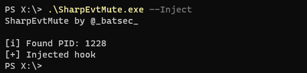
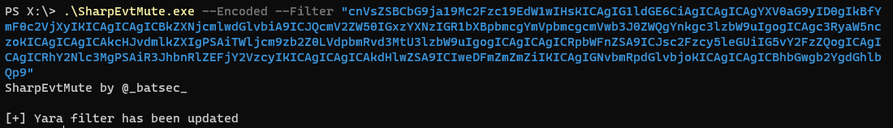

# EvtMute

This is a tool that allows you to offensively use [YARA](http://virustotal.github.io/yara/) to apply a filter to the events being reported by windows event logging.

## Usage

Grap the latest verison from [here](https://github.com/bats3c/EvtMute/releases/tag/v1.0). `EvtMuteHook.dll` contains the core functionality, once it is injected it will apply a temporary filter which will allow all event to be reported, this filter can be dynamically updated without having to reinject. I've written `SharpEvtMute.exe` which is a C# assembly that can easily run via `execute` in shad0w or `execute-assembly` in cobalt strike. I will be writing a native version in C for much better intergration with shad0w.

#### Disabling Logging

A trivial use case would be to disable event logging system wide. To do this we can use the yara rule `rule disable { condition: true }`.

We will need to start by injection the hook into the event service.

    .\SharpEvtMute.exe --Inject



Now that the hook is placed we can add the filter.

    .\SharpEvtMute.exe --Filter "rule disable { condition: true }"


Now all events will be dropped by the event service.

#### Complex Filters

Filters can be dynamically changed without having to reinject a hook. This makes it quick and easy to update the active filter.

An example of a more complex filter would be this. It is capable of blocking the events related to a lsass memory dump being reported by sysmon.

```
rule block_lsass_dump {
    meta:
        author = "@_batsec_"
        description = "Prevent lsass dumping being reported by sysmon"
    strings:
        $provider = "Microsoft-Windows-Sysmon"
        $image = "lsass.exe" nocase
        $access = "GrantedAccess"
        $type = "0x1fffff"
    condition:
        all of them
}
```

With a complex rule like this it is much harder to condense it into a single line. This is why I added the ability to give base64 encoded rules.

The rule can easily be converted to base64 from a linux command line.

    base64 -w 0 YaraFilters/lsassdump.yar | echo $(</dev/stdin)

Then using the `--Encoded` flag we can pass it as a filter



#### Opsec Considerations

When injecting the hook `SharpEvtMute.exe` will call `CreateRemoteThread` and this call is made before the hook is placed so it will be reported by Sysmon. This is because the injection feature of `SharpEvtMute.exe` should only be used as a PoC. I recommend manually injecting `EvtMuteHook.dll` into the event logging service when stealth is important.

It's pid can be found by running `SharpEvtMute.exe --Pid`. The hook can be placed by manually injecting the shellcode (run `make` in EvtMuteBin) via your C2 framework of choice, e.g `shinject` in shad0w.

It is also worth mentioning that the hook will use a named pipe to update filters. The named pipe is called `EvtMuteHook_Rule_Pipe` (this named can be changed easily). There is a rule hard baked into the hook to ensure that any events including this name will be dropped automatically but it will still be an IOC having it listening, so I recommend changing it.

## Community Filters

If you create some useful filters feel free to make a pull request to the `YaraFilters` directory. It would be cool to have a good collection of filters to hide common actions that everyone can benefit from.